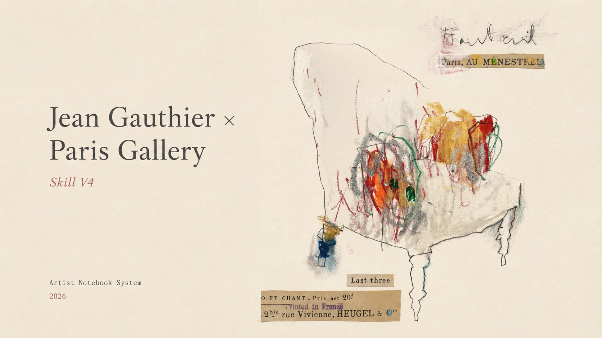

# Jean Gauthier × Paris Gallery Skill V4

A visual direction skill for transforming images into poetic Paris gallery archive artworks.

Inspired by:

- private artist notebooks
- French gallery archives
- atelier fragments
- unfinished paper studies

The goal is not to create a poster.

The goal is to create the feeling of discovering an artist's private study sheet.

---

# Features

✨ Paper-based gallery aesthetics

✨ Handmade material texture

✨ Notebook / atelier atmosphere

✨ Sparse poetic composition

✨ Authentic unfinished artwork feeling

---

# Workflow

## 1. Observe

Identify:

- emotional fragment
- important silhouette
- meaningful texture

## 2. Reduce

Remove unnecessary information.

Keep only the strongest visual memory.

## 3. Reconstruct

Transform into:

- artist notebook page
- gallery archive fragment
- paper artwork

## 4. Add Imperfection

Introduce:

- pencil traces
- watercolor marks
- handwritten notes
- collage fragments

---

# Examples

## Portrait

Human portraits and character studies.

→ `examples/portrait.md`

---

## Landscape

Nature, architecture and spatial memories.

→ `examples/landscape.md`

---

## Still Life

Objects, furniture and poetic studies.

→ `examples/still-life.md`

---

# File Structure

---

# Version

Current version:

**V4.0.0**

Released in 2026.
